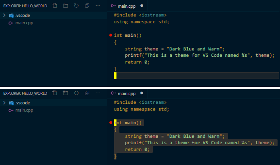

# Dark Blue And Warm Theme for VS Code
## Additional Recommended Settings:
    "editor.cursorStyle": "block",
    "editor.lineDecorationsWidth": 0,
    "editor.scrollbar.verticalScrollbarSize": 10,
    "editor.folding": false,
    "editor.lineNumbers": "off",
    "editor.minimap.enabled": false,
    "editor.overviewRulerBorder": false,
    "editor.renderIndentGuides": false,
    "editor.renderWhitespace": "none",
    "breadcrumbs.enabled": false,
    "workbench.sideBar.location": "left",
    "workbench.activityBar.visible": false,

## Adjust these to your preferences:
    "editor.fontSize": 15,
    "window.zoomLevel": -2,

## Preview:

