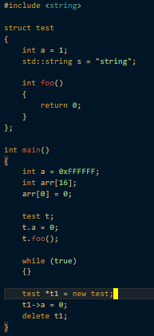

# Dark Blue And Warm Theme for VS Code

## Additional Recommended Settings:

"editor.cursorStyle": "block",
"editor.lineDecorationsWidth": 0,
"editor.scrollbar.verticalScrollbarSize": 10,
"editor.folding": false,
"editor.lineNumbers": "off",
"editor.minimap.enabled": false,
"editor.overviewRulerBorder": false,
"editor.renderIndentGuides": false,
"editor.renderWhitespace": "none",
"breadcrumbs.enabled": false,
"workbench.sideBar.location": "left",
"workbench.activityBar.visible": false,

## Adjust these to your preferences:

"editor.fontSize": 15,
"window.zoomLevel": -2,

## Report Issues

In case you find irregular coloring report is to:

[Issues · heyyod/dark-blue-and-warm (github.com)](https://github.com/heyyod/dark-blue-and-warm/issues)

It would be best to add a screenshot of the textmate scope where the color is not right. You can do this by:

1. Press F1 or Ctrl + Shift + P
2. Search for "token"
3. Click "Developer: Inspect Editor Tokens and Scopes"
4. Select the field where the color is work and take a screenshot of the pop-up box allong with the code.
